# taskmaster

### Overview 
Task master is an android application which let you add new myTasks, assign them to teams and save them.

<!-- 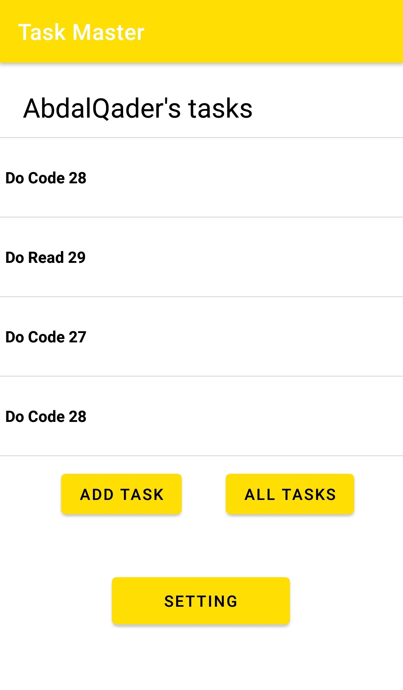 -->

### lab-26)
* home page with title, image and two buttons that when they clicked new activiites will be oened.

* Add Task activity with two input fileds and a button for save(not saving yet), and a counter for all myTasks

* All myTasks activity that has an image and title

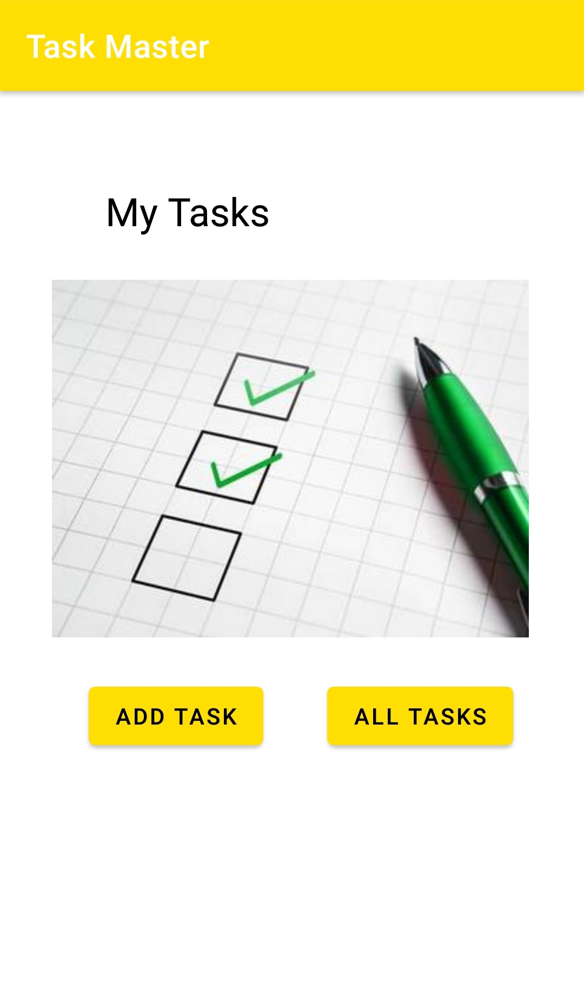

### lab-27

* update home page to show three buttons with hard coded myTask titles, when any button of them is clicked it will open details activity.

* new activity added *details activity* that has two texts, one for description which is *lorem ipsum* for now, and a tiltle that comes from the clicked button in the home page.

* Setting activity added as well, this activity has an input text and save button to store the user input to the shared preferences and get it back in the home page(once the save button clicked, a toast message will be displayed and return to the home page)

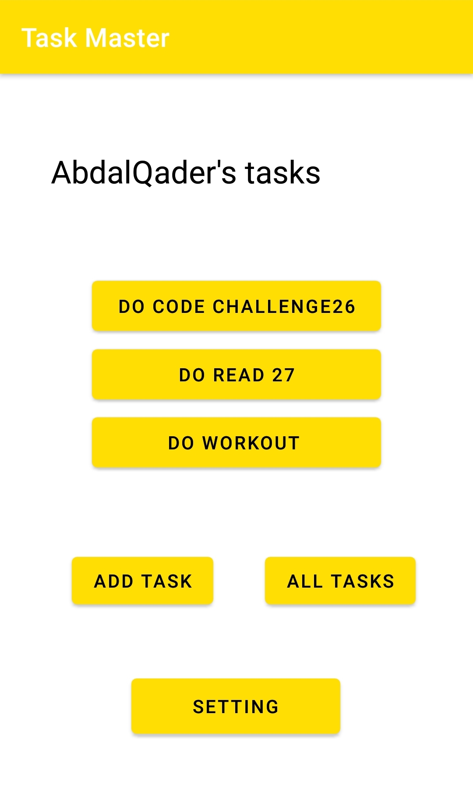

### lab-28

* add Task class that has title, description and state(in progress, new, assigned, complete).
* add custom adapter to show hard coded myTasks dynamically in the home page.
* add listener for the myTask views to show the myTask details in the details activity.

### lab-29

* add the ability for the user to add myTasks.
* implement local database to save the user myTasks
* add the functionality to display the number of myTasks in the add myTask activity

  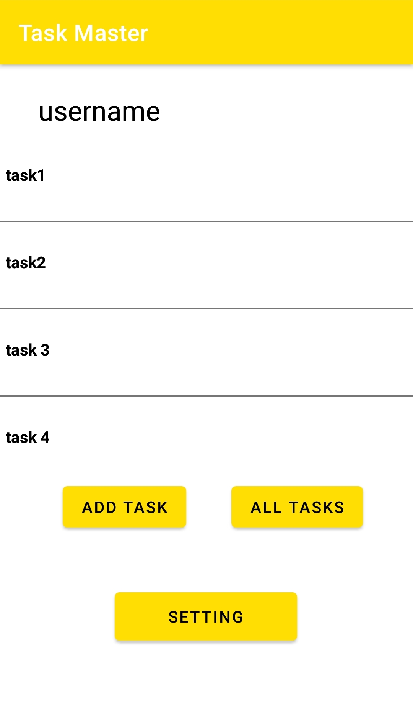
  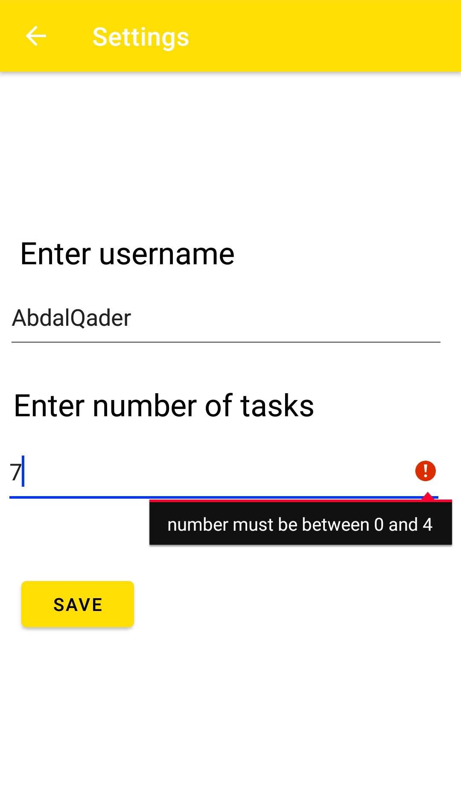
  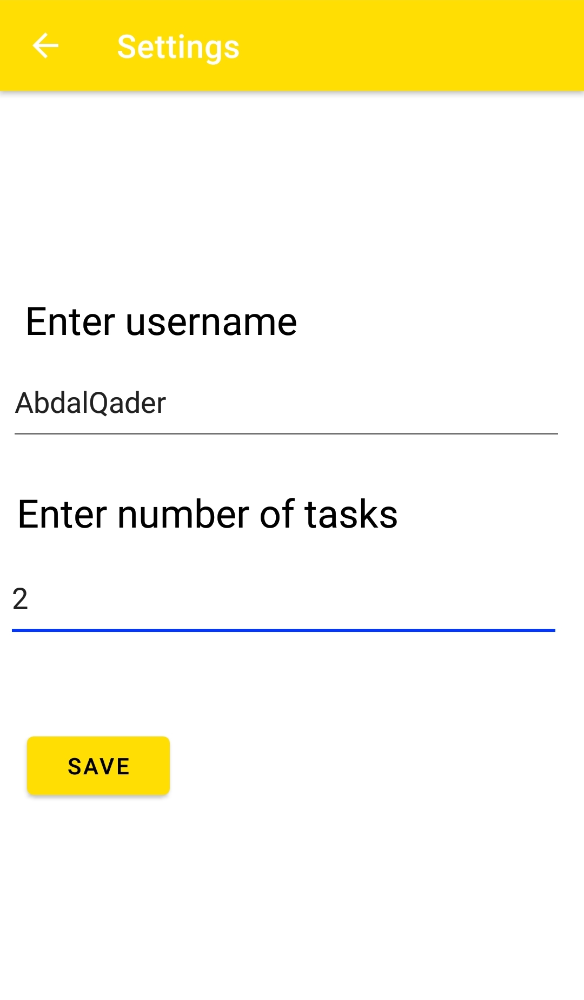
  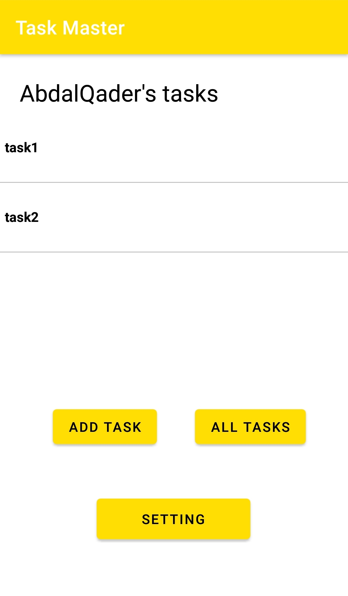
  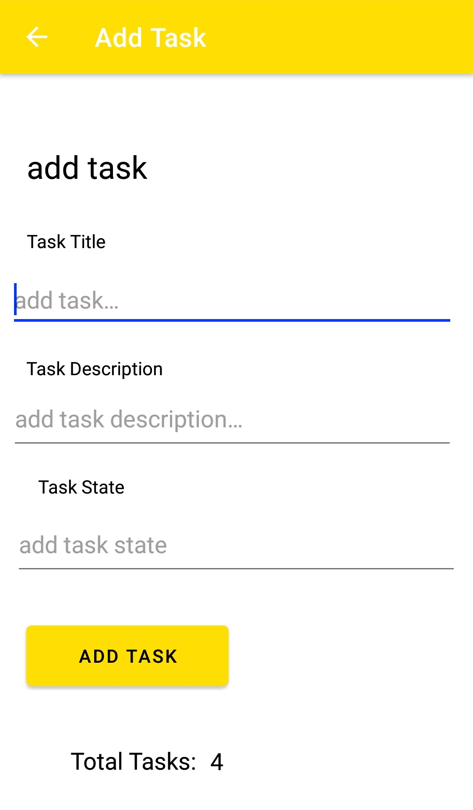
  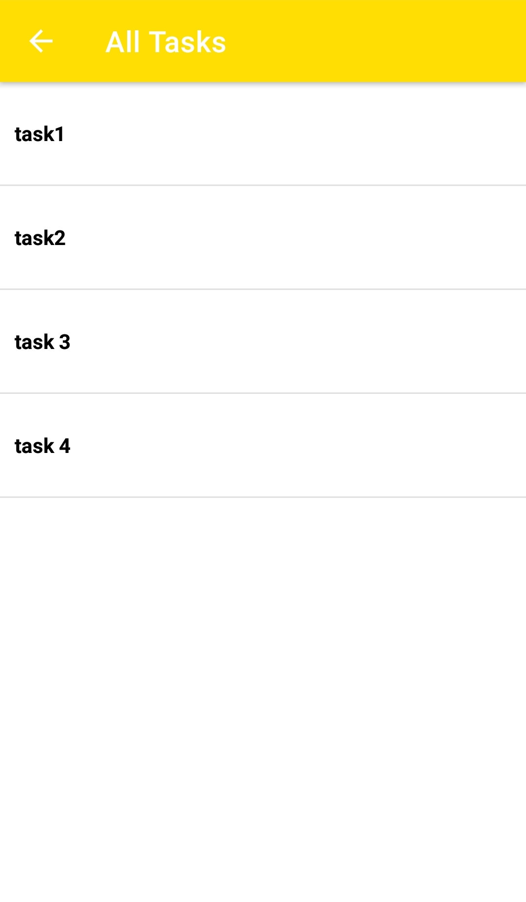

### lab-31

add unit tests, using [Espresso](https://developer.android.com/training/testing/espresso) testing framework

* edit the user’s username, and assert that it says the correct thing on the homepage
* tap on a myTask, and assert that the resulting activity displays the name of that myTask
* assert that important UI elements are displayed on the page

<!-- 
### lab-32

replace room database with amplify which is one of amazon web services (AWS)

* adding amplify dependencies 
* create the schema for the myTask application -->

### lab-36

* add the signup / sign in button so the user can create an account or login if he already has an account.
* display the user username in the main activity

  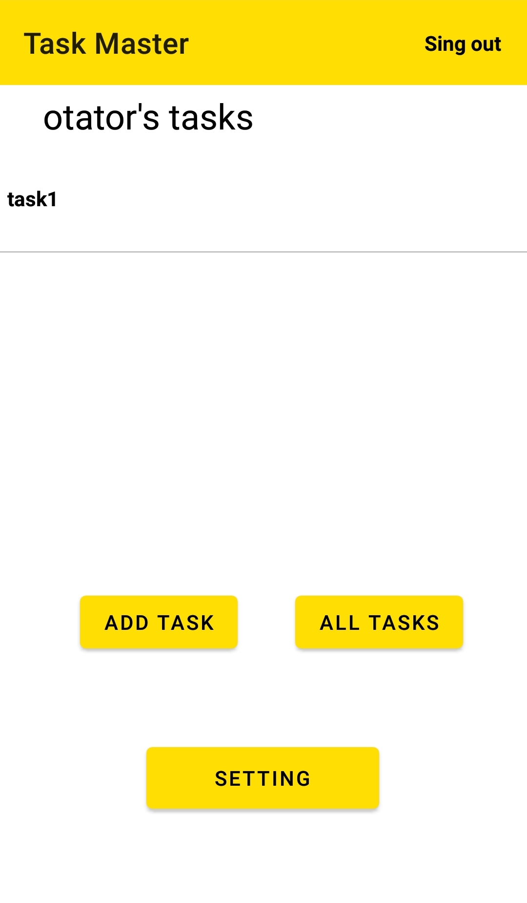
  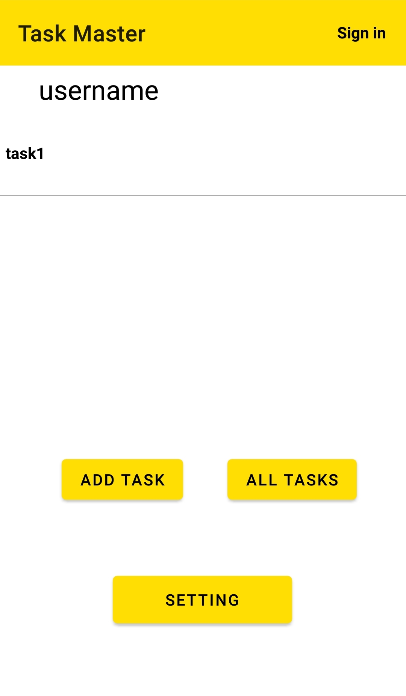

### lab-37

* make the user able to add an image/file from his device and add to the task he is creating using amazon S3 service
* show the image in the details of the task
* if a file chosen, show a link to the file 

  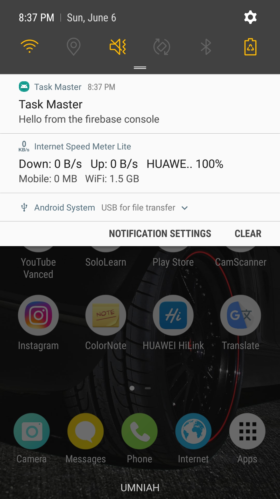

### lab-38

* add notifications to the application using firebase.
* the user can see the notification even if the app is closed

  

### lab-41

* add intent filter so that when ever a user click share button on an image, add task activity shows up
* add the image to a task when the user make a new task

  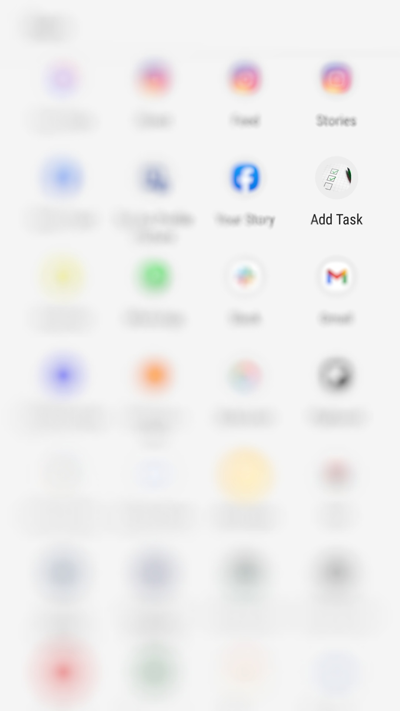

### lab-41

* get the current user application
* add the location to the tasks that the user creates

  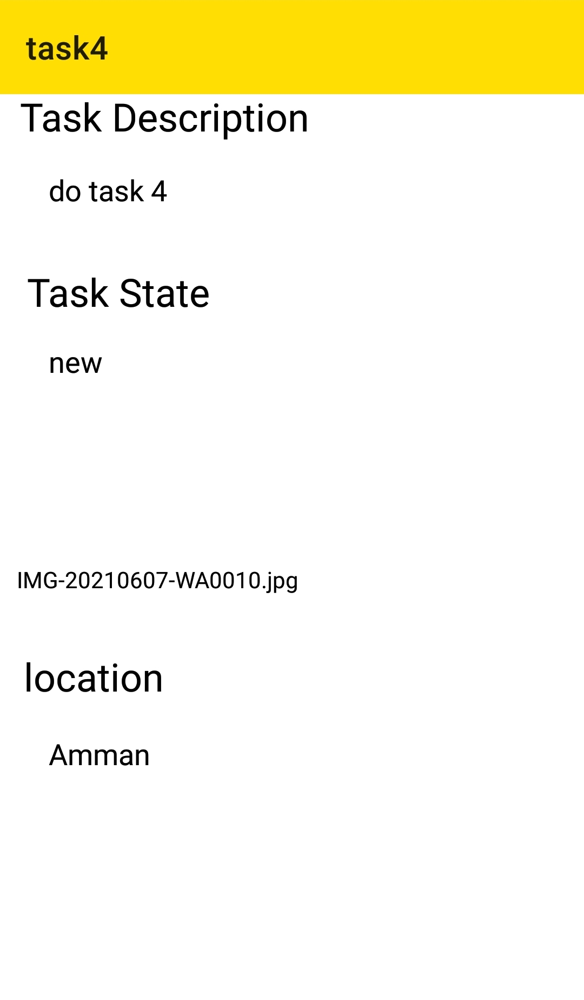

